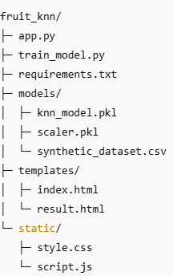
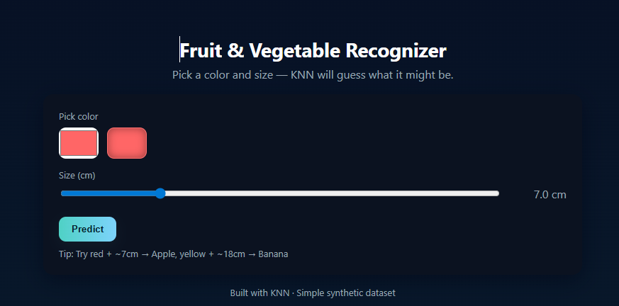
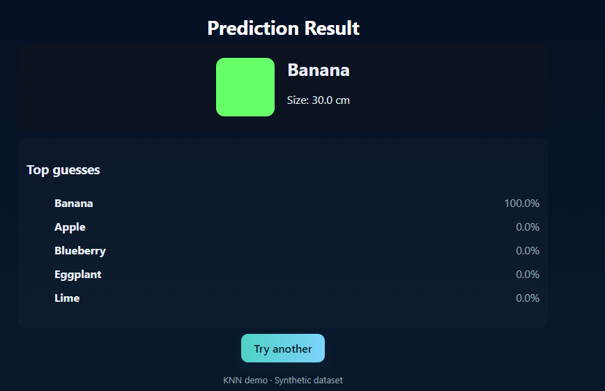

# Fruit & Vegetable Recognizer — KNN Model

A simple yet visually appealing machine learning project that predicts a fruit or vegetable type based on its color and size, using a K-Nearest Neighbors (KNN) model.

The project includes a Flask-based web application with a modern UI where users can select a color (via color picker) and size (via slider) to get predictions.

## Features

- Synthetic dataset generated with realistic RGB color and size variations for common fruits and vegetables.

- KNN model for classification.

- Beautiful, responsive UI built with HTML, CSS, and JavaScript.

- Real-time predictions without uploading images.

- Easily extensible to use real datasets.

## Project Structure

## Installation & Setup
1. Clone the repository

git clone https://github.com/your-username/fruit-knn.git
cd fruit-knn

2. Create a virtual environment and install dependencies

python -m venv venv
### On macOS / Linux
source venv/bin/activate
### On Windows
venv\Scripts\activate

pip install -r requirements.txt

3. Train the model

python train_model.py
This will:

Generate a synthetic dataset with RGB color values and sizes.

Train a KNN model.

Save the model and scaler in the models/ directory.

4. Run the application

python app.py

5. Open in browser
Visit:

http://127.0.0.1:5000/

## How It Works

### Data Generation:
train_model.py creates a dataset of fruits and vegetables with average RGB values and sizes, adding small random variations to simulate real measurements.

### Model Training:
Features (R, G, B, size) are standardized using StandardScaler. A KNN model with n_neighbors=5 is trained.

### Web Interface:
Users select a color and size, which are fed to the trained model for prediction. Top predicted classes are shown with confidence percentages.

### Customization
- Add more items: Modify the prototypes dictionary in train_model.py with new fruits/vegetables.

- Use real data: Replace synthetic generation with a CSV containing real-world measurements (R, G, B, size, label).

- Adjust KNN parameters: Tune n_neighbors or switch algorithms in train_model.py.

## Requirements

- Python 3.8+

- Flask

- numpy

- pandas

- scikit-learn

- joblib

## Install all dependencies with:

pip install -r requirements.txt

## INPUT 

## OUTPUT

